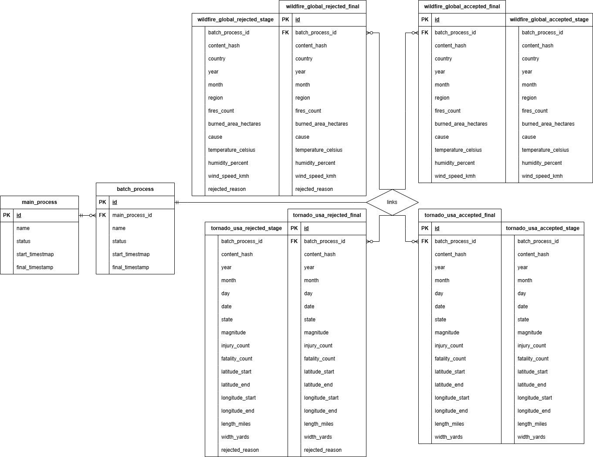

# **Revature Training Project 01**

This is our first data engineering project.

---

### **Contributors**

- Jack
- Nathan

---

### **Timeline**

**Start:** `???`

**Present:** `02/20/2026`

---

### **Project Requirements**

- build a data ingestion pipeline written in `Python`
- use configuration files to define data sources and settings
- read data from at least one source that has at least `2000` non-synthetic records
- read data from both `csv` and `json` formats
- process data (clean, validate, standardize, deduplicate, etc.)
- load processed data into `PostgresSQL` tables
- maintain logs and reports for each process
- handle errors properly, continue with valid records
- handle database connections properly
- write unit tests and achieve at least `80%` coverage
- allow new data sources to be added without major code changes
- use parameterized `SQL` queries to prevent `SQL Injection`
- follow standard naming, formatting, and version-control practices
- showcase at least two feature engineering examples
- create at least three meaningful visualizations
- describe at least one correlation found in the data

---

### **Presentation Requirements**

- create a slide deck for the project
- provide a live demonstration of the project
- present for no longer than ten minutes

---

### **Table of Contents**

- [Environment](./extra/documentation/environment.md)
- [Logging](./extra/documentation/logging.md)
- [Migrations](./extra/documentation/migrations.md)
- [Schema](./extra/documentation/schema.md)

---

### **ERD**

---
